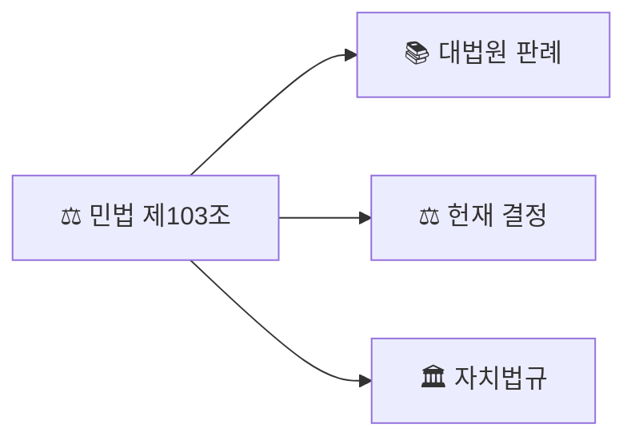

# Korean Law MCP

**법제처 41개 API를 17개 도구로.** 법령, 판례, 행정규칙, 자치법규, 조약, 해석례 + **LLM 환각 방지 인용 검증** + **조문 영향 그래프** + **시점 비교 자동 diff** + **시민 5단계 실행 가이드**를 AI 어시스턴트나 터미널에서 바로 사용.

[](https://www.npmjs.com/package/korean-law-mcp)
[](https://modelcontextprotocol.io)
[](LICENSE)

> 법제처 Open API 기반 MCP 서버 + CLI. Claude Desktop, Cursor, Windsurf, Zed, Claude.ai 등에서 바로 사용 가능.

[English](./README-EN.md)


---

## v4.0 — 3개 킬러 기능 동시 추가

**조문 영향 그래프 + 시점 비교 + 시민 가이드.** 법무팀·연구자·시민이 매뉴얼로 며칠 걸리던 작업이 한 번에.

### 1. `impact_map` — 조문 한 줄의 파급효과 그래프

```
"민법 제103조 인용한 판례"
```

→ 대법원 판례·헌재 결정·법령해석·행정심판·자치법규를 **역방향 탐색** + 조문이 인용한 다른 법령(정방향) + **mermaid 그래프 코드** 자동 생성. claude.ai에서 바로 시각화.



### 2. `time_travel` — 두 시점 본문 자동 diff

```
"개인정보보호법 2020-01-01 vs 2025-11-01"
```

→ 임의의 두 시점에 시행 중이었던 본문을 자동으로 가져와 **조문 단위 자동 diff**: 추가(+) / 삭제(-) / 변경(△) 분류 + 변경 전후 본문 + 자수 변화량.

### 3. `action_plan` — 시민 5단계 실행 가이드

```
"전세금 못 받았어"
```

→ STEP 1 상황진단(주택임대차보호법 자동 식별) → STEP 2 권리/구제수단(판례) → STEP 3 신청기관/기한(행정규칙+해석) → STEP 4 필요서류/양식(별표) → STEP 5 함정/주의(시효·법률구조공단). 시민 자연어 → 실행 가능한 단계로 변환.

### + v4.0.4 — 약어 부분 매칭

기존 약어 처리는 query 전체가 등록 약어와 정확 일치할 때만 동작 ("화관법" → "화학물질관리법"). v4.0.4는 약어가 다른 토큰과 **결합된** query도 풀네임 변형으로 자동 확장.

```
"화관법 시행령"      → "화학물질관리법 시행령"
"화관법 제5조"       → "화학물질관리법 제5조"
"산안법 시행규칙"    → "산업안전보건법 시행규칙"
"중처법 제4조 책임자" → "중대재해 처벌 등에 관한 법률 제4조 책임자"
```

`extractEmbeddedAliases` 신규 + `expandLawQuery`/`expandOrdinanceQuery` 통합. 회귀 0건.

---

## v3.5 — AI 법률 답변의 환각을 잡아내다

**LLM이 지어낸 가짜 조문을 실시간으로 탐지.** 법제처 공식 DB로 모든 인용을 교차검증.

```
"민법 제750조에 따라 불법행위 손해배상을 청구하고,
 근로기준법 제60조 제1항은 연차유급휴가를 규정하며,
 상법 제401조의2 제7항에 따라 이사 책임을 물을 수 있고,
 형법 제9999조는 가중처벌을 정한다"
```

→ `verify_citations` 한 번으로 (실제 법제처 API 교차검증 결과):

- ✓ 민법 제750조(불법행위의 내용) 실존
- ✓ 근로기준법 제60조(연차 유급휴가) 제1항 실존
- ✗ **상법 제401조의2 — 제7항 없음 (최대 제2항)**
- ✗ **형법 제9999조 — 해당 조문 없음 (존재 범위: 제1조~제372조)**

**ChatGPT·Claude가 쓴 법률 답변을 그대로 믿지 마세요.** 법률 AI 서비스, 로펌, 학생, 계약서 검토에서 신뢰도 체크 필수.

---

## v3.2.0+ — 자연어로 복합 분석

사용법은 똑같습니다. **그냥 자연어로 물어보세요.** AI가 질문을 알아듣고, 필요한 분석을 자동으로 추가해줍니다.

### 과태료 받았는데, 감경 가능할까?

```
"식품위생법 영업정지 과태료 감경 가능?"
```

→ 위반 유형별 **처분 기준표** (1차·2차·3차 금액) + **벌칙 조항** 원문 + 실제로 **감경된 행정심판 사례** + 해당 조항 **개정 이력**까지 한 번에 나옵니다.

### 이 물건 수입하려는데, 법적으로 뭘 확인해야 하지?

```
"수입 통관 FTA 적용 확인"
```

→ **관세법** + **관세청 유권해석** + **FTA 조약 원문** + **세율 별표** + 관세 분쟁 시 **조세심판원 판결**까지. 예전에는 법제처·관세청·조세심판원·외교부 4곳을 따로 뒤져야 했습니다.

### 건축허가 처리, 어디서부터 시작하지?

```
"건축법 허가 절차"
```

→ **법적 근거** (법률→시행령→시행규칙) + **수수료·서식** + 관련 **훈령·예규·고시** + 우리 지자체 **조례 특칙** + **유권해석**까지 원스톱.

### 법 하나 고치면 뭐가 같이 바뀌어야 하지?

```
"건축법 영향도 분석"
```

→ **하위법령**(시행령·시행규칙) + 전국 **자치법규** 중 영향받는 것 + 관련 **행정규칙** 목록이 나옵니다.

### 이 법의 위임 사항, 다 만들어졌나?

```
"국민건강보험법 위임입법"
```

→ "시행령으로 정한다"고 돼 있는 조항 중 **아직 시행령이 안 만들어진 것**을 찾아줍니다.

### 이 조례, 상위법에 어긋나지 않나?

```
"주차 조례 상위법 적합성"
```

→ **헌법재판소 위헌 결정** + **행정심판 취소 사례** 중 비슷한 조례 관련 건을 검색하고, **상위법 근거**를 대조합니다.

### 이 조문, 언제 바뀌었고 판례는 어떻게 달라졌지?

```
"근로기준법 개정이력 타임라인"
```

→ **신구대조표** + 조문별 **개정 이력** + 해당 법령의 **판례·해석례**를 시간순으로 묶어줍니다.

---

> **사용법 변경 없음.** 기존처럼 자연어로 물어보면 됩니다. 질문에 따라 AI가 알아서 추가 분석을 붙입니다.
>
> 모든 결과 끝에 **"이어서 할 수 있는 조회"**가 제안됩니다. 복사해서 바로 이어가세요.

<details>
<summary>v3.2.1~v3.5.5 변경 이력</summary>

**v3.5.5** — 법제처 API 봇 차단 우회 (긴급 핫픽스)

법제처 OPEN API가 Node.js 기본 User-Agent(`undici/...`)를 봇으로 분류해 거부하기 시작 → fly.dev/Vercel 등 모든 클라우드 호스팅에서 `[EXTERNAL_API_ERROR] fetch failed` 또는 "사용자 정보 검증에 실패하였습니다" XML로 죽는 현상.

- **`fetch-with-retry.ts`에 일반 브라우저 UA 기본 헤더 주입** — 호출자 코드 변경 0, 한 줄 패치로 모든 도구 복구. `LAW_USER_AGENT` 환경변수로 override 가능
- 에러 메시지가 "정확한 서버장비의 IP주소 및 도메인주소를 등록해 주세요"여서 IP 화이트리스트 차단으로 오인되기 쉬웠음 — 실제 원인은 UA 검증
- claude.ai 커스텀 커넥터로 `https://korean-law-mcp.fly.dev/mcp?oc=...` 사용하던 사용자 즉시 영향. v3.5.5 배포로 자동 복구

**v3.5.4** — 실사용 피드백 반영: NOT_FOUND 명시 시그널 전면 도입

사용자 피드백: "실사용하면 자꾸 답변 못 찾고 AI가 지맘대로 답변함. 못 찾으면 리턴값을 명확하게."

**근본 원인**: 일부 도구가 조회 실패 시 `isError` 플래그를 세팅하지 않거나 "없습니다"만 반환 → LLM이 실패 감지 못하고 창작 답변 생성.

- **`[NOT_FOUND]` / `[HALLUCINATION_DETECTED]` 머신 파싱 마커 전면 도입** — 모든 실패 응답에 기계적으로 감지 가능한 프리픽스 + "⚠️ LLM은 추측/생성 금지" 경고문 표준화
- **`verify_citations`** — `failCount > 0`일 때 `isError: true` 설정. 환각 검출됐는데 "검증 성공"으로 오인되던 심각한 버그 수정
- **`annex.ts` / `law-text.ts` / `article-detail.ts` 등 10+개 파일** — `isError: true` 누락 수정
- **체인 도구 부분 실패 투명화** — `chains.ts`의 silent-drop 패턴 제거. 실패한 섹션도 `[NOT_FOUND / FAILED]` 마커와 사유를 명시 노출 (80자 → 200자 확장)
- 신규 헬퍼 `notFoundResponse(message, suggestions?)`로 일관성 확보

**v3.5.3** — `verify_citations` 실증 검증 후 3개 치명 버그 수정

실제 법제처 API로 5건 테스트 → false negative 3건 발견 → 근본 원인 수정:

- **"민법" → "난민법" 부분매칭 오매칭** — 기존 `chains.ts`의 `findLaws`/`scoreLawRelevance`가 이미 해결해둔 로직인데 verify_citations가 재사용하지 않고 자체 로직으로 중복 구현했던 것. 공용 모듈 `lib/law-search.ts`로 추출하여 양쪽 재사용 (중복 제거)
- **원숫자(①②③…) 항번호 파싱 실패** — 법제처 API가 `항번호`를 `"① "` 형태로 리턴하는데 기존 `parseInt(raw.replace(/[^\d]/g, ""))`가 유니코드 원숫자를 제거해 NaN. 근로기준법 제60조 제1항이 실존함에도 "최대 제0항" 오판정 → `lib/article-parser.ts`에 `parseHangNumber()` 원숫자 매핑 유틸 추가
- **짧은 법령명 검색 누락** — 법제처 lawSearch API가 `display=20`에서 "상법"을 결과 34번째로 리턴. `apiClient.searchLaw`에 display 파라미터 추가, verify_citations는 `searchDisplay=100`으로 호출

검증 후 5/5 정확 판정 (위 예시 결과가 그 출력).

**v3.5.2** — kordoc 2.3.0 → 2.4.0 업데이트 (별표/서식 파싱 엔진)

**v3.5.1** — lite/full 프로필 체계 제거 (V3_EXPOSED 16개 고정 노출 도입 후 실질 미사용). `tool-profiles.ts`에서 `LITE_TOOLS`/`parseProfile`/`filterToolsByProfile` 제거, 헬스 엔드포인트 거짓 `profiles` 필드 → 정확한 `tools: { exposed: 16, total: 92 }` 로 교체. Breaking change 아님 (`?profile=lite`도 이미 무시되던 값)

**v3.5.0** — Killer feature: `verify_citations` 인용 검증 + Critical 핫픽스 + 보안 강화

- **`verify_citations`** 신규 — LLM 환각 방지. 사용자 텍스트에서 조문 인용 정규식 추출 + 직전 30자 lookback으로 법령명 역추적 + 법제처 DB 병렬 교차검증. 결과: ✓(실존) / ✗(없음, 존재 범위 제시) / ⚠(법령명 불명확)
- **Critical 핫픽스** — v3.4.0 `full` 파라미터가 12개 도메인(tax_tribunal, customs, ftc, pipc, nlrc, acr, treaty, interpretation 등)에서 스키마에 필드가 없어 묵묵히 무시되던 문제 수정. `unified-decisions.ts`가 하위 핸들러 응답을 받은 뒤 `compactLongSections()` 후처리로 계단식 축약 일괄 적용
- **보안 High 2건** — `fetch-with-retry.ts` 타임아웃/네트워크 에러에 API 키 포함 URL이 로그로 유출되던 문제 → `maskSensitiveUrl()`로 `OC=***` 마스킹. `trust proxy true` → `TRUST_PROXY` 환경변수(기본 `1`), X-Forwarded-For 스푸핑 rate limit 우회 차단
- **품질 3건** — `decision-compact.ts` 날짜 정규식 경계 가드, TAIL 경계 `". "` 오탐 제거, `stripRepeatedSummary` 종료점 정확 탐지
- **UX** — 체인 8개 description 구체화(LLM이 체인 선택 가능), 검색 결과 "💡 다음: get_law_text(...)" 힌트, `search_law` 약칭/오타 확장 자동 재시도, `query-router` 패턴 5개 추가, `discover_tools` 별칭 매칭 27개

**v3.4.0** — 판례 응답 토큰 평균 74% 감축 + `get_decision_text`에 `full` 파라미터 추가

법령 RAG 관점에서 판례 응답 구조를 재해석: 판시사항·판결요지·주문은 규범 재사용의 핵심이라 full 유지, "이유" 전문은 사안별 사실관계 나열이라 LLM이 대부분 소비만 하고 버림. 이 비대칭을 활용해 판례/헌재/행심(`precedent`/`constitutional`/`admin_appeal`) 3개 도메인에 **계단식 축약 + structured ref densify** 적용. `lib/decision-compact.ts` 신규:

- **`compactBody`** — 전문/이유 섹션을 앞 800자 + 중략 마커 + 뒤 400자로 축약. 판결 종결어미(`~다.`, `~라 할 것이다.`)와 문장 경계 가드 내장. `minSave` 가드로 짧은 본문(1300자 이하)은 skip
- **`densifyLawRefs`** — 참조조문의 괄호 설명 제거 (`제390조(채무불이행과 손해배상)` → `제390조`). 평균 40~55% 절감
- **`densifyPrecedentRefs`** — 참조판례의 "선고"/"판결" 제거 + 날짜 공백 압축 (`2020. 3. 26. 선고 2018두56077 판결` → `2020.3.26. 2018두56077`)
- **`stripRepeatedSummary`** — 법제처 API가 판시/요지를 본문 앞쪽에 또 섞어 보내는 케이스 탐지·제거

`get_decision_text`에 `full?: boolean` 파라미터 추가. 미지정(기본)=축약, `true`=전문. 응답 중간의 `⋯ 중략 N자 (full=true로 전문 조회) ⋯` 마커가 재호출 힌트 역할.

**실측 (실제 법제처 API, 고정 ID 8건)**:

| 도메인 | Before avg | After avg | 절감 |
|---|---:|---:|---:|
| 판례 | 5,230 chars | 3,049 chars | **-42%** |
| 헌재 | 8,368 chars | 1,703 chars | **-80%** |
| 행심 | 8,429 chars | 1,491 chars | **-82%** |
| **종합** | **7,606 chars (1,901 tok)** | **1,960 chars (490 tok)** | **-74%** |

긴 결정례(15,000자↑)에서 **80~89%** 절감이 가장 두드러짐. 짧은 본문은 `minSave` 가드로 원본 유지. 품질 손실 없음 (판시·요지·주문은 항상 full).

부가로 **ListTools 페이로드도 -14%** (9,671 → 8,296 bytes, 344 토큰↓): `chain_*` 8개 description 간결화, `search_decisions`/`get_decision_text` 필드 describe에서 17 도메인 이중 기재 제거.

**v3.3.1** — 법령 약칭 사전 대폭 확장 (11 → 52개, +41)

lexdiff에서 "산안기준규칙" 질의가 법제처 aiSearch의 키워드 부분매칭으로 **국가표준기본법**으로 환각되던 사례가 발견돼 `resolveLawAlias`의 `LAW_ALIAS_ENTRIES`를 대폭 보강. 다빈도 노무/안전(산안법·중처법·근기법 등), 개인정보/정보통신(개보법·정보통신망법), 청렴/이해충돌(청탁금지법·이해충돌방지법), 공공계약(국가계약법·지방계약법), 부동산/임대차(주임법·상임법·부거법), 공정거래(공정거래법·하도급법·약관법·표시광고법·가맹사업법), 금융(자본시장법·특금법·전금법), 도시계획(국토계획법·도정법), 환경(감염병예방법·대기환경법), 운수(여객운수법·화물운수법), 민·형사 절차(민소법·형소법·민집법), 사회보험(국건법·산재보험법·고보법), 통신(전기통신사업법) 커버. `api-client.ts`/`law-parser.ts`가 이미 `resolveLawAlias`를 사용 중이라 **데이터 추가만으로 기존 검색 경로가 자동 혜택**. 신규 41개 + 회귀 4개 포함 **45/45 테스트 통과**.

**v3.3.0** — HTTP stateless 모드 전환 + kordoc 2.3.0

원격 서버(`korean-law-mcp.fly.dev`)가 주기적으로 OOM kill로 재시작되면서 기존 세션 ID가 무효화되던 문제를 근본 해결. MCP 공식 stateless 패턴(`sessionIdGenerator: undefined`)으로 전환하여 매 요청마다 fresh `Server + Transport`를 생성, 요청 종료 시 즉시 해제. in-memory 세션 Map·InMemoryEventStore·idle cleanup 전부 제거로 누수 원인 소거. 재시작·스케일아웃·배포 모두 무손실. `GET /mcp`·`DELETE /mcp`는 공식 예제와 동일하게 `405`. API 키는 `AsyncLocalStorage`로 요청 단위 격리 (race condition 방지).

- **HTTP stateless 전환** — [src/server/http-server.ts](src/server/http-server.ts) (참고: `@modelcontextprotocol/sdk/examples/server/simpleStatelessStreamableHttp.js`)
- **kordoc 2.2.5 → 2.3.0** — 별표/서식 파싱 엔진 업데이트
- **세션 관리 코드 완전 제거** — `sessions` Map, `MAX_SESSIONS`, idle cleanup `setInterval`, `InMemoryEventStore`, POST/GET/DELETE 분기 로직 삭제 (v3.2.3의 LRU eviction 접근을 대체)

**v3.2.3** — HTTP 세션 안정성 중간 개선. `MAX_SESSIONS` 100→500 + LRU eviction. _v3.3.0의 stateless 전환으로 대체됨._

**v3.2.2** — 별표/서식 조회 도구(`get_annexes`)를 기본 노출 도구에 추가. **노출 도구 수 14 → 15개**. 환불·감경 키워드 질의 시 별표 자동 조회 로직 추가.

**v3.2.1** — kordoc 2.2.5 업데이트.

</details>

<details>
<summary>개발자용: 시나리오 기술 상세</summary>

기존 8개 체인 도구에 `scenario` 파라미터가 추가되었습니다. (노출 도구 수는 v3.2.2에서 `get_annexes` 노출 추가로 14 → 15개)

| scenario | 호스트 체인 | 추가 조회 |
|---------|-----------|----------|
| `penalty` | chain_action_basis | 별표 처분기준표 + 벌칙 조항 + 감경 행심 + 개정이력 |
| `customs` | chain_full_research | 관세청 해석례 + 조세심판 + FTA 조약 + 세율표 + 3단비교 |
| `manual` | chain_procedure_detail | 법체계(행정규칙) + 해석례 + 연계 자치법규 |
| `delegation` | chain_law_system | 위임법령 현황 + 법체계(행정규칙) + 조문 이력 |
| `impact` | chain_law_system | 법체계 트리 + 연계 조례 + 조문별 연계 + 행정규칙 |
| `timeline` | chain_amendment_track | 판례 + 해석례 시계열 매핑 |
| `compliance` | chain_ordinance_compare | 헌재 위헌 결정 + 행심 위법 취소 + 상위법 근거 |

시나리오는 쿼리 키워드에서 **자동 감지**되거나, `scenario` 파라미터로 **직접 지정**할 수 있습니다.

**기타 개선:**
- 법령체계도(`get_law_system_tree`)에 행정규칙(훈령/예규/고시) 출력 추가
- 법령 검색 3차 fallback — 복합 쿼리에서 법령명 패턴 자동 추출
- `chain_action_basis` 판례/해석례 검색 정확도 향상 (법령명 기반 검색)

</details>

<details>
<summary>v3.1.0~v3.1.5 변경 이력</summary>

**v3.1.5** — kordoc 2.2.4 + 문서 파싱 엔진 강화. README 현행화.

**v3.1.4** — kordoc 2.2.4 업데이트. 병합 셀 HTML `<table>` 출력, markdownToHwpx 서식 강화.

**v3.1.3** — 검색 결과 없음 힌트 통합 (18개 도구). 세션 정리 주기 단축 (30분→10분).

**v3.1.2** — kordoc 2.2.1 업데이트. GFM 테이블 특수문자 이스케이프 및 pipe 충돌 방지.

**v3.1.1** — kordoc 2.1→2.2 업데이트.

## v3.1.0 — Production Hardening

프로덕션 리뷰 기반 20개 파일 수정. 잠재적 버그, 보안, 안정성 일괄 개선.

- **truncateResponse 누락 일괄 수정** — 17개 도구에서 50KB 응답 제한 미적용 수정
- **HTTP 서버 세션 제한** — MAX_SESSIONS=100 추가, 503 응답 (DoS 방어)
- **CORS 와일드카드 경고** — 미설정 시 stderr 경고 로그 추가
- **파라미터 오염 방어** — `search_decisions`/`get_decision_text`의 options에서 핵심 필드 덮어쓰기 차단
- **체인 도구 안정성** — 인증 에러(401/403/429) 즉시 전파, findLaws 안전 래핑
- **API 클라이언트** — throwIfError에서 response body 소비 (stream 리크 방지)
- **CLI 개선** — REPL 모드 Ctrl+C 2회 강제종료 구현
- **SSE 서버 제거** — 사용되지 않는 데드코드 삭제 (HTTP 서버가 SSE 스트리밍 지원)
- **데드 코드/의존성 정리** — `zod-to-json-schema`, ordinance 힌트, `start:sse` script

</details>

<details>
<summary>v3.0.x 변경 이력</summary>

**v3.0.2** — Unified Architecture + Setup Wizard

법제처 41개 API를 89개 MCP 도구로 구조화했던 v2.
v3는 같은 41개 API를 **15개 도구**로 재압축했습니다.

| | 법제처 원본 | v2 | v3 |
|---|:---:|:---:|:---:|
| API/도구 수 | 41 | 89 | **15** |
| AI 컨텍스트 비용 | - | ~110 KB | **~20 KB** |
| 기능 커버리지 | - | 100% | **100%** |
| 프로필 관리 | - | lite/full 분리 | **단일 (불필요)** |

### 왜 89개가 14개가 됐나

v2의 실수: API 하나당 도구 하나. 직관적이지만, AI 입장에서는 89개 스키마를
전부 읽어야 해서 **컨텍스트의 절반을 도구 목록에 소비**했습니다.

v3의 발상 전환: 비슷한 패턴의 도구를 `domain` 파라미터 하나로 통합.
판례·헌재·조세심판·공정위 등 **17개 도메인**이
`search_decisions(domain)` + `get_decision_text(domain)` **2개**로 합쳐졌습니다.

나머지 전문 도구(용어, 별표, 이력 등)는 그대로 작동하되,
`discover_tools` → `execute_tool`로 필요할 때만 접근합니다.

### 사용자 입장에서 뭐가 좋아지나

- **AI가 더 정확함** — 89개 중 고르던 AI가, 14개만 보고 즉시 판단
- **응답 속도 체감 향상** — 컨텍스트 82% 절감
- **설정 단순화** — lite/full 프로필 선택 불필요. 모든 클라이언트에서 동일한 14개
- **17개 결정례 도메인 즉시 접근** — discover 거치지 않고 바로 검색

### 기타 변경

- **kordoc 1.6 → 2.2.5** — 문서 파싱 엔진 업그레이드 (XLSX/DOCX 지원, 보안 강화, 양식 채우기)
- **행정심판 전문 조회 버그 수정** — API 응답 키 fallback 추가
- **영문법령 전문 조회 버그 수정** — 신형 API 응답 구조 지원

### 개발자에게

MCP 도구 설계에서 **도구 수 ≠ 기능 수**입니다.
41개 API를 89개로 펼쳤다가 다시 14개로 접은 이 과정이
"적정 추상화 수준"을 찾는 여정이었습니다.

핵심 패턴: **Dispatch Table + Domain Enum**.
기존 handler 함수는 한 줄도 수정하지 않았습니다.

</details>

<details>
<summary>v2.x 변경 이력</summary>

**v2.3.2** — 프로덕션 코드 품질 개선 (47파일, -179줄). 이모지/장식 축소, 체인 캐시, 에러 처리 통일.

**v2.3.0** — 도구 프로필 (lite/full), URL 쿼리 API 키, kordoc 통합 파서.

**v2.2.0** — 23개 신규 도구 (64→87). 조약, 법령-자치법규 연계, 문서분석 엔진.

**v1.8~1.9** — 체인 도구 8개, 일괄 조문 조회, AI 검색 필터, 구조화 에러 포맷.

</details>

---

## 왜 만들었나

대한민국에는 **1,600개 이상의 현행 법률**, **10,000개 이상의 행정규칙**, 그리고 대법원·헌법재판소·조세심판원·관세청까지 이어지는 방대한 판례 체계가 있습니다. 이 모든 게 [법제처](https://www.law.go.kr)라는 하나의 사이트에 있지만, 개발자 경험은 최악입니다.

이 프로젝트는 그 전체 법령 시스템을 **15개 도구**로 감싸서, AI 어시스턴트나 스크립트에서 바로 호출할 수 있게 만듭니다. 법제처를 백 번째 수동 검색하다 지친 공무원이 만들었습니다.

---

## 설치 및 사용법

### 0단계: API 키 발급 (무료, 1분)

모든 방법에 공통으로 필요한 **법제처 Open API 인증키(OC)**를 먼저 발급받으세요.

1. [법제처 Open API 신청 페이지](https://open.law.go.kr/LSO/openApi/guideList.do)에 접속합니다.
2. 회원가입 후 로그인합니다.
3. **"Open API 사용 신청"** 버튼을 누릅니다.
4. 신청서를 작성하면 **인증키(OC)**가 발급됩니다. (예: `honggildong`)
5. 이 인증키를 아래 설정에서 사용합니다.

---

### 방법 1: Claude Code 플러그인 (한 줄 설치, 가장 쉬움) ⚡

[Claude Code](https://claude.com/claude-code)를 쓴다면 두 줄이면 끝. API 키는 설치 중 자동으로 물어봅니다.

```
/plugin marketplace add chrisryugj/korean-law-mcp
/plugin install korean-law@korean-law-marketplace
```

설치 중 **법제처 API 키**를 입력하라는 프롬프트가 뜹니다 (0단계에서 발급받은 `honggildong` 같은 키). 민감정보로 안전하게 저장됩니다.

**사용:** Claude Code에 자연어로 질문하면 `korean-law` MCP 도구가 자동 호출됩니다.

```
"근로기준법 제74조 알려줘"
"민법 제750조 판례 검증해줘"
```

**업데이트:** 새 버전이 나오면 한 줄로 최신화
```
/plugin marketplace update korean-law-marketplace
```

> 내부적으로 `npx korean-law-mcp@latest`를 실행하므로 npm에 배포된 최신 버전이 항상 사용됩니다.

#### Troubleshooting: `Permission denied (publickey)` 에러

설치 중 다음 에러가 뜨면 Claude Code 설치기가 GitHub에 SSH로 접속을 시도했는데 SSH 키가 등록돼 있지 않은 경우입니다 (특히 처음 Git을 쓰는 비개발자/법률 실무자에게 자주 발생).

```
Failed to install: Failed to clone repository: Cloning into
  '/Users/<user>/.claude/plugins/cache/temp_github_<id>'...
  git@github.com: Permission denied (publickey).
  fatal: Could not read from remote repository.
```

**해결 방법 (둘 중 하나 선택):**

1. **HTTPS로 강제 우회 (가장 간단, 추천):** 터미널에 한 줄 실행 후 다시 `/plugin install` 시도
   ```bash
   git config --global url."https://github.com/".insteadOf "git@github.com:"
   ```

2. **SSH 키 생성 후 GitHub에 등록:** GitHub 계정으로 다른 저장소를 SSH로 자주 쓸 예정이라면
   ```bash
   ssh-keygen -t ed25519 -C "your-email@example.com"   # 엔터 3번
   cat ~/.ssh/id_ed25519.pub                            # 출력 복사
   ```
   복사한 공개키를 [GitHub → Settings → SSH and GPG keys → New SSH key](https://github.com/settings/keys)에 붙여넣기

설치 후에도 위 rewrite 설정은 그대로 둬도 무방합니다 (HTTPS clone이 항상 동작).

---

### 방법 2: Claude.ai 웹에서 바로 사용 (설치 없음)

아무것도 설치하지 않고, 주소 하나만 입력하면 됩니다. Claude Pro/Max/Team/Enterprise 요금제가 필요합니다 (Free는 커넥터 1개만 가능).

**커넥터 추가 방법:**

1. [claude.ai](https://claude.ai)에 로그인합니다.
2. 왼쪽 사이드바 하단의 **본인 이름**을 클릭합니다.
3. **"설정"** (또는 Settings)을 선택합니다.
4. **"커넥터"** (또는 Connectors) 메뉴로 들어갑니다.
5. **"커스텀 커넥터"** 영역에서 **"커스텀 커넥터 추가"** 버튼을 클릭합니다.
6. 아래 내용을 입력합니다:
   - **이름**: `korean-law` (원하는 이름 아무거나 OK)
   - **URL**: 아래 주소를 붙여넣으세요. `honggildong` 부분을 **0단계에서 발급받은 본인 인증키**로 바꾸세요:

```
https://korean-law-mcp.fly.dev/mcp?oc=honggildong
```

7. **추가** 버튼을 누르면 등록 완료!

**도구 활성화 (중요!):**

8. 추가한 커넥터의 **"구성"** (또는 Configure)을 클릭합니다.
9. 도구 목록이 나오면, 모든 도구를 **"항상 사용"** (또는 Always allow)으로 설정합니다.
10. 이렇게 하면 매번 승인할 필요 없이 AI가 바로 법령을 검색할 수 있습니다.

**사용하기:**

11. 채팅 화면으로 돌아가서 "근로기준법 제74조 알려줘"라고 입력하면 끝!

> **참고**: 커넥터 URL을 수정하려면 삭제 후 다시 추가해야 합니다.

> v3부터 프로필 선택이 필요 없습니다. 15개 도구가 41개 API 전체를 커버합니다.
> 기존에 `?profile=lite&oc=...` 주소를 넣으셨다면 **그대로 두셔도 됩니다** — 동일하게 작동합니다.

---

### 방법 3: AI 데스크톱 앱에서 사용 (설치 없음)

Claude Desktop, Cursor, Windsurf 같은 **데스크톱 앱**을 쓰고 있다면, 설정 파일에 아래 내용을 추가하세요.

**설정 파일 위치 찾기:**

| 앱 이름 | Windows | Mac |
|---------|---------|-----|
| Claude Desktop | `%APPDATA%\Claude\claude_desktop_config.json` | `~/Library/Application Support/Claude/claude_desktop_config.json` |
| Cursor | 프로젝트 폴더 안 `.cursor/mcp.json` | 프로젝트 폴더 안 `.cursor/mcp.json` |
| Windsurf | 프로젝트 폴더 안 `.windsurf/mcp.json` | 프로젝트 폴더 안 `.windsurf/mcp.json` |

#### Claude Desktop

Claude Desktop은 원격 HTTP MCP 서버를 직접 연결하지 못하므로 `mcp-remote` 어댑터를 통해 연결합니다. [Node.js](https://nodejs.org) 18 이상이 필요합니다 (`npx` 사용을 위해).

```json
{
  "mcpServers": {
    "korean-law": {
      "command": "npx",
      "args": [
        "-y",
        "mcp-remote",
        "https://korean-law-mcp.fly.dev/mcp?oc=honggildong"
      ]
    }
  }
}
```

> `honggildong`을 본인 인증키로 바꾸세요. Node.js를 설치하기 싫다면 [방법 4](#방법-4-내-컴퓨터에-직접-설치-오프라인-가능)의 로컬 설치를 사용하세요.

#### Cursor, Windsurf 등 (원격 HTTP 지원 클라이언트)

```json
{
  "mcpServers": {
    "korean-law": {
      "url": "https://korean-law-mcp.fly.dev/mcp?oc=honggildong"
    }
  }
}
```

> 이미 다른 MCP 서버가 설정되어 있다면, `"mcpServers": { ... }` 안에 `"korean-law": { ... }` 부분만 추가하면 됩니다.

저장 후 앱을 **재시작**하면 법령 도구가 활성화됩니다.

---

### 방법 4: 내 컴퓨터에 직접 설치 (오프라인 가능)

인터넷 없이 쓰고 싶거나, 원격 서버를 거치지 않으려면 직접 설치할 수 있습니다.

**사전 준비:** [Node.js](https://nodejs.org) 18 이상이 설치되어 있어야 합니다.

**자동 설치 (추천):**

```bash
npx korean-law-mcp setup
```

설치 마법사가 API 키 입력 → AI 클라이언트 선택 → 설정 파일 자동 등록까지 한 번에 처리합니다.
Claude Desktop, Claude Code, Cursor, VS Code, Windsurf, Gemini CLI를 지원합니다.

**수동 설치:**

```bash
npm install -g korean-law-mcp
```

AI 앱 설정 파일에 아래 내용을 추가합니다 (`honggildong`을 본인 인증키로 바꾸세요):

```json
{
  "mcpServers": {
    "korean-law": {
      "command": "korean-law-mcp",
      "env": {
        "LAW_OC": "honggildong"
      }
    }
  }
}
```

앱을 재시작하면 완료!

---

### 방법 5: 터미널(CLI)에서 직접 사용

개발자라면 터미널에서 직접 법령을 검색할 수 있습니다.

```bash
# 설치
npm install -g korean-law-mcp

# 인증키 설정 (honggildong을 본인 키로 바꾸세요)
export LAW_OC=honggildong        # Mac/Linux
set LAW_OC=honggildong           # Windows CMD
$env:LAW_OC="honggildong"       # Windows PowerShell

# 사용 예시
korean-law "민법 제1조"                    # 자연어로 바로 조회
korean-law search_law --query "관세법"     # 도구 직접 호출
korean-law list                            # 전체 도구 목록
korean-law list --category 판례            # 카테고리별 필터
korean-law help search_law                 # 도구별 도움말
```

---

### API 키 전달 방법 정리

여러 방법으로 인증키를 전달할 수 있습니다. 위에서부터 우선 적용됩니다:

| 방법 | 사용법 | 언제 쓰나 |
|------|--------|-----------|
| URL에 포함 | 주소 끝에 `?oc=내키` | 웹 클라이언트에서 가장 간편 |
| HTTP 헤더 | `apikey: 내키` | 프로그래밍으로 연동할 때 |
| 환경변수 | `LAW_OC=내키` | 로컬 설치(방법 3, 4) |
| 도구 파라미터 | `apiKey: "내키"` | 특정 요청만 다른 키 쓸 때 |

---

## 사용 예시

```
"관세법 제38조 알려줘"
→ search_law("관세법") → MST 획득 → get_law_text(mst, jo="003800")

"화관법 최근 개정 비교"
→ "화관법" → "화학물질관리법" 자동 변환 → compare_old_new(mst)

"근로기준법 제74조 해석례"
→ search_interpretations("근로기준법 제74조") → get_interpretation_text(id)

"산업안전보건법 별표1 내용 알려줘"
→ get_annexes(lawName="산업안전보건법 별표1") → HWPX 파일 다운로드 → 표/텍스트 Markdown 변환
```


---

## 도구 구조 (15개)

v3는 15개 도구만 노출합니다. 나머지 전문 도구는 `discover_tools` → `execute_tool`로 접근.

| 구분 | 도구 | 설명 | 시나리오 확장 |
|------|------|------|-------------|
| **체인** (8) | `chain_full_research` | 종합 리서치 (AI검색→법령→판례→해석) | `customs`: 관세·통관 종합 |
| | `chain_law_system` | 법체계 분석 (3단비교, 위임구조) | `delegation`: 위임입법 감시 / `impact`: 영향도 분석 |
| | `chain_action_basis` | 처분 근거 확인 (허가·인가·처분) | `penalty`: 처분·벌칙 기준 종합 |
| | `chain_dispute_prep` | 쟁송 대비 (불복·소송·심판) | — |
| | `chain_amendment_track` | 개정 추적 (신구대조, 연혁) | `timeline`: 시계열 타임라인 |
| | `chain_ordinance_compare` | 조례 비교 (상위법→전국 조례) | `compliance`: 상위법 적합성 검증 |
| | `chain_procedure_detail` | 절차·비용·서식 안내 | `manual`: 공무원 처리 매뉴얼 |
| | `chain_document_review` | 계약서·약관 리스크 분석 | — |
| **법령** (3) | `search_law` | 법령 검색 → lawId, MST 획득 |
| | `get_law_text` | 조문 전문 조회 |
| | `get_annexes` | 별표/서식 조회 (금액표·요율표·별지서식) |
| **통합** (2) | `search_decisions` | **17개 도메인** 통합 검색 (판례·헌재·조세심판·공정위·노동위·관세·해석례·행심·개인정보위·권익위·소청심사·학칙·공사공단·공공기관·조약·영문법령) |
| | `get_decision_text` | **17개 도메인** 전문 조회 |
| **메타** (2) | `discover_tools` | 전문 도구 검색 (용어·별표·이력·비교 등) |
| | `execute_tool` | 전문 도구 프록시 실행 |

전체 도구 상세는 [docs/API.md](docs/API.md) 참조.

---

## 주요 특징

- **41개 API → 15개 도구** — 법령, 판례, 행정규칙, 자치법규, 헌재결정, 조세심판, 관세해석, 조약, 학칙/공단/공공기관 규정, 법령용어
- **MCP + CLI** — Claude Desktop에서도, 터미널에서도 같은 도구 사용
- **법률 도메인 특화** — 약칭 자동 인식(`화관법` → `화학물질관리법`), 조문번호 변환(`제38조` ↔ `003800`), 3단 위임 구조 시각화
- **별표/별지서식 본문 추출** — HWPX·HWP·PDF·XLSX·DOCX 자동 변환 ([kordoc](https://github.com/chrisryugj/kordoc) 엔진)
- **8개 체인 + 7개 시나리오** — 기본 체인에 상황별 확장 분석 자동 추가 (과태료 감경, 관세 통관, 위임입법 감시 등)
- **17개 도메인 통합 검색** — `search_decisions` 하나로 판례·헌재·조세심판·공정위·노동위 등 즉시 접근
- **캐시** — 검색 1시간, 조문 24시간 TTL
- **원격 엔드포인트** — 설치 없이 `https://korean-law-mcp.fly.dev/mcp`로 바로 사용

---

## 문서

- [docs/API.md](docs/API.md) — 도구 레퍼런스
- [docs/ARCHITECTURE.md](docs/ARCHITECTURE.md) — 시스템 설계
- [docs/DEVELOPMENT.md](docs/DEVELOPMENT.md) — 개발 가이드

## Star History

<a href="https://www.star-history.com/?repos=chrisryugj%2Fkorean-law-mcp&type=timeline&legend=bottom-right">
  <picture>
    <source media="(prefers-color-scheme: dark)" srcset="https://api.star-history.com/chart?repos=chrisryugj/korean-law-mcp&type=timeline&theme=dark&legend=top-left" />
    <source media="(prefers-color-scheme: light)" srcset="https://api.star-history.com/chart?repos=chrisryugj/korean-law-mcp&type=timeline&legend=top-left" />
    
  </picture>
</a>

## 라이선스

[MIT](./LICENSE)

---

<sub>Made by 류주임 @ 광진구청 AI동호회 AI.Do</sub>
